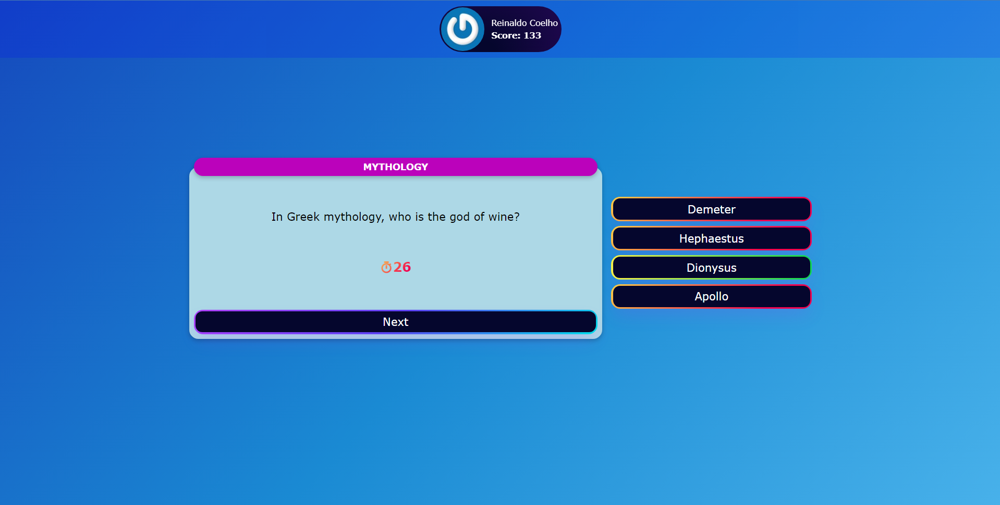
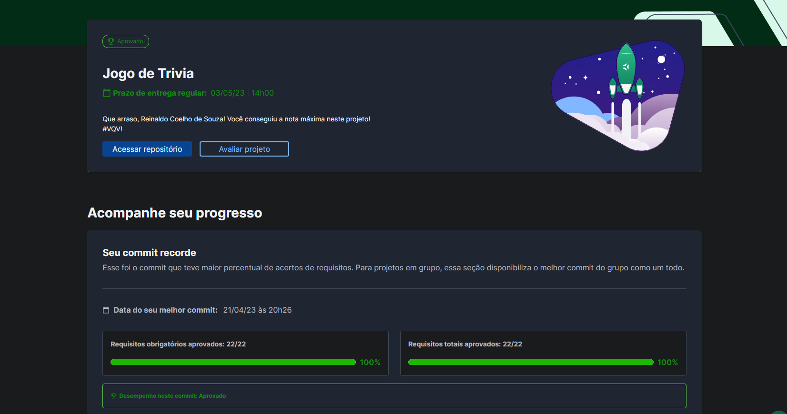

# ❔ Trivia Game

## 📘 Sobre

Jogo no estilo Trivia em que são feitas perguntas de diversos temas. As perguntas foram retiradas da [Api do Trivia](https://opentdb.com/api_config.php). O projeto foi inicialmente desenvolvido em grupo com as pessoas desenvolvedoras [Anderson Huang](https://github.com/andhuangg) e [Gabriel Rodrigues](https://github.com/gabrielr99). Após a entrega do projeto, fiz a estilização e implementei algumas features individualmente.

## 🧩 Funcionalidades

- Entrar na aplicação com um email e nome.
- Responder às perguntas em um período de 30 segundos.
- Visualizar uma tela de feedbacks, contendo total de acertos e score.
- Visualizar uma tela de ranking local, construída usando LocalStorage.
- Tela de configurações, podendo alterar a dificuldade, tema e quantidade de perguntas.

[Navegar para a aplicação](https://coelhoreinaldo.github.io/trivia-game).

## ⚛️ Ferramentas

Projeto construído utilizando React.js.

- JavaScript;
- Redux;
- Componentes de Classe;
- React Router;
- Requisição de API em React;
- States;
- Props;
- Forms em React;
- RTL e Jest;
- Mobile First;
- Scrum e Kanban.

## 🛠️ Como executar o projeto?

1. Instalando dependências

`npm install`

2. Executando a aplicação

`npm start`

## 📝 Nota

## ©️ Copyright

Este projeto foi inicialmente desenvolvido em grupo. A partir dos commits do dia 24/04, todo o código refatorado e o CSS implementado são de minha autoria e os direitos são reservados a mim. A logo "Trivia" é de autoria da Trybe.
